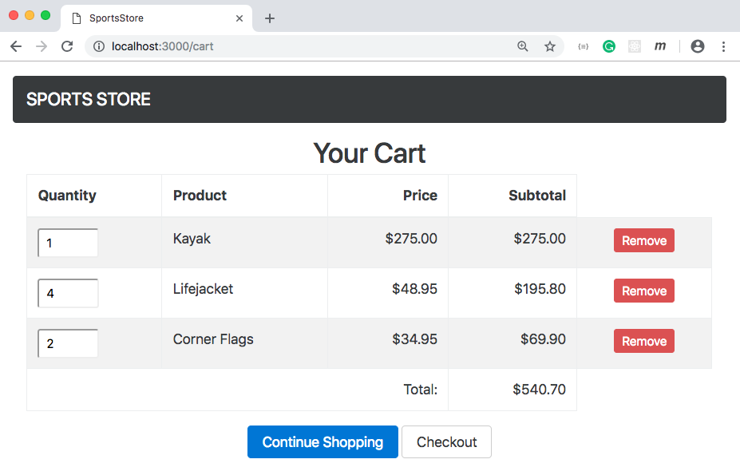
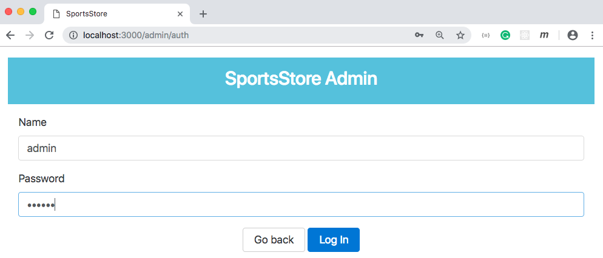
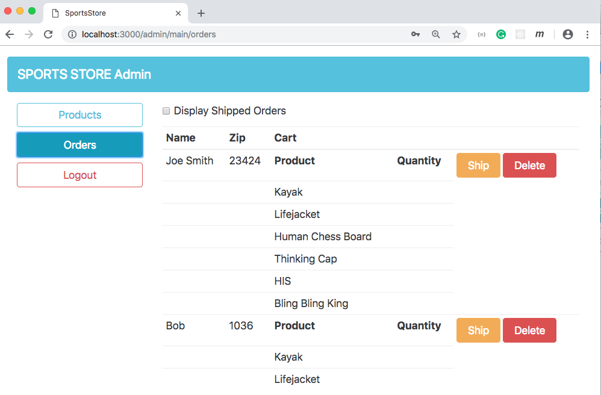

# SportsStore
> This is a simple e-commerce web application to demonstrate specific features of **Angular**.

It has the following features:

* An Online Product Catalog - Customers can browse by category and page.
* A Shopping Cart - Users can add and remove products.
* A Checkout - Customers can enter their shipping details and place their orders.
* Administration Area - It includes create, read, update, and delete (CRUD) facilities for managing the catalog.

## Installation
1. Download or clone this repo.
2. Run `$ npm install` under project directory.
3. Run the server and the client: `$ npm run start`

## Screenshots
### Landing Page

### Cart

### Checkout Step 1

### Checkout Step 2

### Login To Admin

### Admin Dashboard

### Admin Orders

### Admin Products Edit

